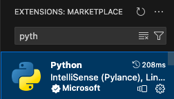
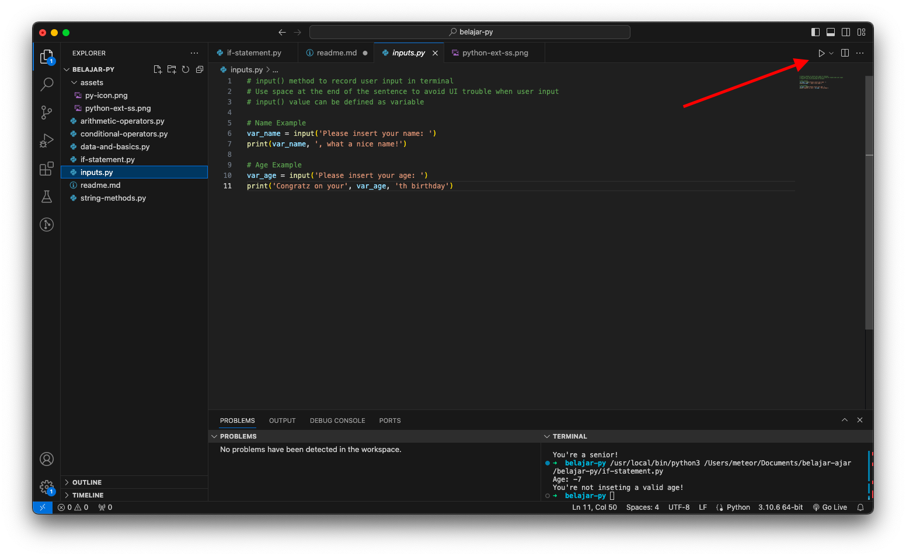

# Python Cheat Sheet (Not For Beginners)
*Disclaimer: Make sure that you're at least understand the basics of coding before you access this


## How to Setup

Download Python at [this link](https://www.python.org/downloads/)!

or you can use Mac and Brew and run this command

```bash
# Install python version manager
brew install pyenv

# Install latest python (example)
pyenv install 3.11.0 
```

and see [this link](https://github.com/pyenv/pyenv). to setup your python or pip path

## Install Python by Microsoft extension if you're using VSCode

By [this link](https://code.visualstudio.com/docs/languages/python). It will direct you to Python extension that is compulsory if you're using VSCode to code python.

or...

You can just install it through VSCode Extenstion menu.



## How to run code?

After everything installed, you can access a file and click the play button on the top right of your VSCode to run python code in terminal.



## File Guide (Sorted by the Basics to Advance)

1. data-and-basics.py
2. inputs.py
3. arithmetic-operators.py
4. string-methods.py
5. conditional-operators.py
6. if-statement.py
7. array-list-of-data.py
8. loop-iteration.py
9. objects-dictionaries.py
10. functions.py